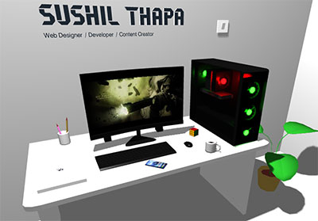

# 3D Interactive Portfolio

[](https://opensource.org/licenses/MIT) <!-- Placeholder License -->

A personal portfolio website designed with Three.js, creating an immersive 3D room environment to showcase projects and information.

<!-- Optional: Add a GIF or a static image of the portfolio in action -->


## ✨ Features

*   **Interactive 3D Environment:** Explore a detailed 3D room.
*   **Theme Switching:** Dynamically switch between light and dark themes.
*   **Navigation:** Smooth camera transitions to "About Me" and "Projects" sections.
*   **Clickable Objects:** Interact with elements in the scene like a book, light switch, and project displays.
*   **Animations:** Utilizes GSAP for smooth animations and transitions.
*   **Responsive Design:** Adapts to different screen sizes for a consistent experience.
*   **Dynamic Content Loading:** Loads 3D models, textures, and fonts.

## 🚀 Live Demo

[Link to live demo]() <!-- TODO: Add live demo link -->

## 🛠️ Technologies Used

*   **Frontend:** HTML5, CSS3, JavaScript (ES6+)
*   **3D Rendering:** [Three.js](https://threejs.org/) (r149)
*   **Animation:** [GSAP (GreenSock Animation Platform)](https://greensock.com/gsap/)
*   **Build Tool:** [Vite](https://vitejs.dev/)
*   **UI Controls (Development):** [dat.GUI](https://github.com/dataarts/dat.gui) (listed as a dependency)
*   **Model Loading:** GLTFLoader with DRACOLoader for compressed 3D models.

## ⚙️ Setup and Installation

1.  **Clone the repository:**
    ```bash
    git clone https://your-repository-url.git # TODO: Update with actual repository URL
    cd 3d-portfolio
    ```

2.  **Install dependencies:**
    Make sure you have [Node.js](https://nodejs.org/) installed.
    ```bash
    npm install
    ```

3.  **Run the development server:**
    ```bash
    npm run dev
    ```
    This will start the Vite development server, typically at `http://localhost:5173`.

## 📜 Available Scripts

In the project directory (`3d-portfolio`), you can run the following scripts:

*   `npm run dev`: Starts the development server with hot reloading.
*   `npm run build`: Builds the application for production to the `dist` folder.
*   `npm run preview`: Serves the production build locally for preview.
*   `npm run host`: Starts the development server and makes it accessible on your local network.

## 📁 Project Structure

```
.
├── README.md                # This file
└── 3d-portfolio/
    ├── index.html           # Main HTML entry point
    ├── main.js              # Core Three.js and application logic
    ├── style.css            # Main stylesheet
    ├── vite.config.js       # Vite configuration
    ├── package.json         # Project dependencies and scripts
    ├── public/              # Static assets
    │   ├── draco/           # DRACO decoder files
    │   ├── fonts/           # Font files (e.g., unione.json, helvatica.json)
    │   ├── images/          # Image assets (e.g., favicon.png, logo.png, preview.jpg)
    │   ├── models/          # 3D models (e.g., room.glb)
    │   └── textures/        # Texture files (e.g., arcane.mp4, book-inner2.png)
    └── ... (other Vite and Node.js files like .gitignore, package-lock.json)
```

## 📄 License

This project is licensed under the MIT License. See the [LICENSE](LICENSE.md) file for details. <!-- TODO: Create a LICENSE.md file if desired -->

## 🙏 Acknowledgements

*   [Three.js](https://threejs.org/) team and community.
*   Creators of the 3D models and textures used. <!-- TODO: Add specific credits if applicable -->

---

_This README was generated with assistance from an AI tool._
